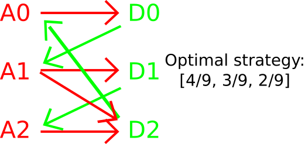

[](https://github.com/ambv/black)

## Purpose and definitions
The following rock paper scissors generalisation applies to several use-cases, one of them being fighting games. Hence, we'll use "attacker" for player 1 and "defender" for player 2.
The goal is to find the optimal play given a game configuration. Here "optimal play" is defined by "the strategy used by the attacker that the defender can least abuse of". The attacker's strategy is public and is quantified by the probability of playing each option.


In a balanced game, like the original rock paper scissors, the optimal play is simple: the attacker should play 1/3 A0, 1/3 A1 and 1/3 A2.  
<p align="center">
    
</p>
 <!-- [ -->

In an unbalanced game however, for example if an attack covers two defenses, the optimal play is counter intuitive as the strongest attack is not the most used:
 <!-- [   -->
 <p align="center">
    
</p>

This project uses a symbolic solver to obtain the optimal strategy for a given game configuration. To achieve this, we look for the attack configuration that makes all defense configurations equivalent.
It also has a brute force example.

## Install
Tested with Python 3.6 but should work as long as sympy is installed.
```
pip install -r requirements.txt
```

## Usage
**Using the solver:**  
Change the matrix "m" in the file "solver.py" to fit the game's configuration. Rows are attacks, columns are defenses. For the "unbalanced game" described in this readme it would be:
```
m = Matrix([[1, 0, -1], [-1, 1, 1], [0, -1, 1]])
``` 
Then start the script:
``` 
python solver.py
```

Note: this example only uses +1, 0 or -1 values that mean "win, neutral or lose". But, the solver can be used as is with other values that quantify how hard an option beats another. For example, the first attack could be high risk/high reward:
```
m = Matrix([[1.5, 0, -1], [-1.5, 1, 1], [0, -1, 1]])
``` 

**Using the brute force**  
The EV equation has to be manually changed in the brute_force.py file). Then start the script:
``` 
python brute_force.py
``` 
## Work in progress
Handle the case where the 2 players don't have the same number of options (non square matrix)